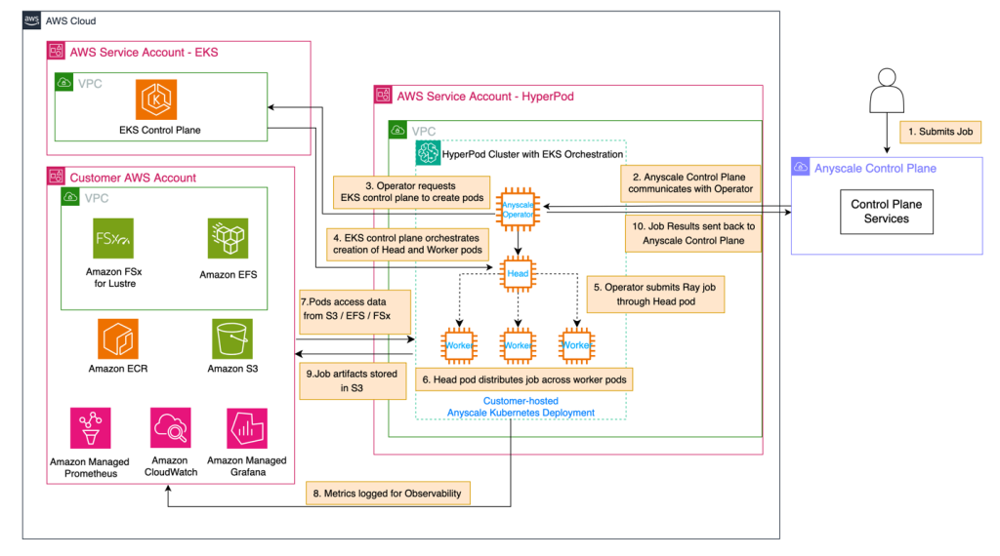

## Solution overview
The following architecture diagram illustrates SageMaker HyperPod with Amazon EKS orchestration and Anyscale.




See [here](details.md) for more details on this architecture.

## Getting Started
### Prerequisites
1. **AWS Account Setup**
    1. An **AWS account** with billing enabled
    1. [**AWS Identity and Access Management**](https://aws.amazon.com/iam/)(IAM) role permissions for SageMaker HyperPod
    1. [**AWS Credentials**](https://docs.aws.amazon.com/cli/latest/userguide/cli-chap-configure.html) set up in your local environment, either as environment variables or through credentials and profile files.
    1. [**AWS CLI**](https://docs.aws.amazon.com/cli/latest/userguide/getting-started-install.html) installed on your local laptop.
1. **Tools** installed on your local laptop:
    1. **Git CLI** on a mac with `brew` via `brew install git`. Other [install options](https://git-scm.com/install/mac) are available.
    1. **Terraform** (version 1.0.0 or later) on a mac with `brew` via `brew tap hashicorp/tap` then `brew install terraform`. Other [install options](https://developer.hashicorp.com/terraform/tutorials/gcp-get-started/install-cli) are available.
    1. Basic understanding of Terraform and Infrastructure as Code
    1. **helm CLI** on a mac with `brew` via `brew install helm`. Other [install options](https://helm.sh/docs/intro/install/) are available.
    1. **kubectl CLI** on a mac with `brew` via `brew install kubectl`. Other [install options](https://kubernetes.io/docs/tasks/tools/) are available.
1. **Anyscale Account Setup**
    1. **Anyscale CLI** installed on your local laptop via `pip install anyscale --upgrade`.
    1. An **Anyscale organization** (account).
    1. Authenticate local environment with Anyscale. Run `anyscale login`, open the link which is output in your browser, and click approve.

## Set up SageMaker HyperPod
### Customize HyperPod Deployment Configuration

Review the default configurations in the existing `terraform.tfvars` file and make modifications to customize your deployment as needed.

* Variables you will likely want to update

    ```tf
    anyscale_new_cloud_name = "my-new-cloud-name"
    kubernetes_version = "1.31"
    eks_cluster_name = "my-eks-cluster"
    hyperpod_cluster_name = "my-hyperpod-cluster"
    resource_name_prefix = "hyperpod-prefix-name"
    aws_region = "us-west-2"
    availability_zone_id  = "usw2-az2"
    ```

### Deployment

> Note: You may need to increase some quotas e.g., the defaults create 2 NAT Gateways which require Elastic IP Addresses.

First, clone the HyperPod Helm charts GitHub repository  to locally stage the dependencies Helm chart:

```shell
git clone https://github.com/aws/sagemaker-hyperpod-cli.git /tmp/helm-repo
```

Apply the terraform

```shell
terraform init
terraform plan
terraform apply
```
### Verify your connection to the HyperPod cluster

Using the output from the Terraform modules, verify a connection to the HyperPod cluster. It should look sonething:

```shell
aws eks update-kubeconfig --region <region> --name <my-eks-cluster>
kubectl get nodes -L node.kubernetes.io/instance-type -L sagemaker.amazonaws.com/node-health-status -L sagemaker.amazonaws.com/deep-health-check-status $@
```

### Install additional EKS components

In this step, you install the required components for autoscaling, load balancing, and Envoy Gateway on your EKS cluster.

The Anyscale Operator requires the following components:
* [Cluster autoscaler](https://github.com/kubernetes/autoscaler/tree/master/charts/cluster-autoscaler)
* [AWS LBC (Load Balancer controller)](https://github.com/kubernetes-sigs/aws-load-balancer-controller/tree/main/helm/aws-load-balancer-controller)
* An ingress or gateway controller (Envoy Gateway is recommended; Nginx is also supported)
* (Optional) [Nvidia device plugin](https://github.com/NVIDIA/k8s-device-plugin/tree/main?tab=readme-ov-file#deployment-via-helm) (required if utilizing GPU nodes)

Run the following command to connect your terminal to the EKS cluster:

```shell
aws eks update-kubeconfig --region <your_aws_region> --name <your_eks_cluster_name>
```

#### Install the Cluster autoscaler

Install the Kubernetes Autoscaler Helm chart:

```shell
helm repo add autoscaler https://kubernetes.github.io/autoscaler
helm upgrade cluster-autoscaler autoscaler/cluster-autoscaler \
  --version 9.46.0 \
  --namespace kube-system \
  --set awsRegion=<your_aws_region> \
  --set 'autoDiscovery.clusterName'=<your_eks_cluster_name> \
  --install
```

#### Install the AWS load balancer controller

```shell
helm repo add eks https://aws.github.io/eks-charts
helm upgrade aws-load-balancer-controller eks/aws-load-balancer-controller \
  --version 1.13.2 \
  --namespace kube-system \
  --set clusterName=<your_eks_cluster_name> \
  --install
```

#### Install an ingress or gateway controller

> **Note:** Envoy Gateway is the recommended ingress controller for Anyscale on Kubernetes. Other gateway and ingress controllers are supported. See [Ingress and gateway controllers](https://docs.anyscale.com/administration/cloud-deployment/kubernetes/) for all supported options.

##### Option A: Envoy Gateway (recommended)

Install Envoy Gateway v1.7.0:

```shell
helm install eg oci://docker.io/envoyproxy/gateway-helm \
  --version v1.7.0 \
  --namespace envoy-gateway-system \
  --create-namespace

kubectl wait --for=condition=available deployment/envoy-gateway \
  -n envoy-gateway-system --timeout=120s
```

Create a file named `envoyproxy.yaml` with the following contents:

```yaml
apiVersion: gateway.envoyproxy.io/v1alpha1
kind: EnvoyProxy
metadata:
  name: envoy-proxy
  namespace: envoy-gateway-system
spec:
  provider:
    type: Kubernetes
    kubernetes:
      envoyService:
        type: LoadBalancer
        annotations:
          service.beta.kubernetes.io/aws-load-balancer-type: external
          service.beta.kubernetes.io/aws-load-balancer-nlb-target-type: instance
          service.beta.kubernetes.io/aws-load-balancer-scheme: internet-facing
```

Apply the resource:

```shell
kubectl apply -f envoyproxy.yaml
```

Create a file named `gatewayclass.yaml` with the following contents:

```yaml
apiVersion: gateway.networking.k8s.io/v1
kind: GatewayClass
metadata:
  name: eg
spec:
  controllerName: gateway.envoyproxy.io/gatewayclass-controller
  parametersRef:
    group: gateway.envoyproxy.io
    kind: EnvoyProxy
    name: envoy-proxy
    namespace: envoy-gateway-system
```

Apply the resource:

```shell
kubectl apply -f gatewayclass.yaml
```

##### Option B: Nginx ingress controller

A sample file, `sample-values_nginx.yaml` has been provided in this repo. Please review for your requirements before using.

Run:

```shell
helm repo add nginx https://kubernetes.github.io/ingress-nginx
helm upgrade ingress-nginx nginx/ingress-nginx \
  --version 4.12.1 \
  --namespace ingress-nginx \
  --values sample-values_nginx.yaml \
  --create-namespace \
  --install
```

#### (Optional) Install the Nvidia device plugin

> **HyperPod note:** you can skip this step on SageMaker HyperPod. The HyperPod dependencies Helm chart (installed as part of standard HyperPod EKS setup) already bundles the NVIDIA device plugin, so `nvidia.com/gpu` capacity is advertised on GPU nodes out of the box. See [Installing packages on the Amazon EKS cluster using Helm](https://docs.aws.amazon.com/sagemaker/latest/dg/sagemaker-hyperpod-eks-install-packages-using-helm-chart.html). Install the plugin below only on non-HyperPod EKS clusters that do not already have it.

If you intend to use NVIDIA GPUs in your Anyscale workloads, install the NVIDIA device plugin. A sample file, `sample-values_nvdp.yaml` has been provided in this repo. Please review for your requirements before using.

```shell
helm repo add nvdp https://nvidia.github.io/k8s-device-plugin
helm upgrade nvdp nvdp/nvidia-device-plugin \
  --namespace nvidia-device-plugin \
  --version 0.17.1 \
  --values sample-values_nvdp.yaml \
  --create-namespace \
  --install
```

#### GPU scheduling on HyperPod

Two HyperPod-specific behaviors affect how Anyscale workloads request GPU capacity.

**1. No default GPU taints.** HyperPod does not apply `NoSchedule` taints to GPU worker nodes, so no toleration is required by default. Only if you choose to taint your own GPU nodes (for example `nvidia.com/gpu=present:NoSchedule`) do you need to add a matching toleration to `global.tolerations` in the Anyscale operator Helm values.

**2. No accelerator-type labels by default.** The HyperPod dependencies chart installs the NVIDIA device plugin but not GPU Feature Discovery (GFD), so accelerator-type labels (`nvidia.com/gpu.product`, `.memory`, `.count`, `.family`, plus CUDA/driver labels) are not present. You have two options:

- **Default: generic GPU requests.** Use generic `GPU` requests in your Anyscale [declarative compute configs](https://docs.anyscale.com/configuration/compute/declarative). This works against any GPU node HyperPod provisions:

  ```yaml
  worker_nodes:
    - required_resources:
        GPU: 1
        CPU: 8
  ```

- **Opt-in: install GFD for accelerator-type selectivity.** If you need to target specific accelerators (for example `accelerator_type: A10G`), install the NVIDIA GFD Helm chart. It bundles Node Feature Discovery, so a single install brings up the `nvidia.com/*` labels within ~30s:

  ```shell
  helm repo add nvidia https://nvidia.github.io/k8s-device-plugin
  helm upgrade --install gpu-feature-discovery nvidia/gpu-feature-discovery \
    --version 0.18.2 \
    --namespace gpu-feature-discovery \
    --create-namespace \
    --wait
  ```

  If you already run NFD (for example via the GPU Operator), disable the bundled subchart with `--set node-feature-discovery.enabled=false`. AWS documents an equivalent static-manifest GFD install for HyperPod UltraServer clusters in [Using UltraServers in Amazon SageMaker HyperPod](https://docs.aws.amazon.com/sagemaker/latest/dg/sagemaker-hyperpod-ultraserver.html).

### Register the Anyscale Cloud

Ensure that you are logged into Anyscale with valid CLI credentials. (`anyscale login`)

1. Using the output from the Terraform modules, register the Anyscale Cloud. It should look sonething like:

```shell
anyscale cloud register --provider aws \
  --name <anyscale-cloud-name> \
  --compute-stack k8s \
  --region us-west-2 \
  --s3-bucket-id <anyscale_example_bucket> \
  --kubernetes-zones us-west-2a,us-west-2b,us-west-2c \
  --anyscale-operator-iam-identity arn:aws:iam::123456789012:role/my-kubernetes-cloud-node-group-role
```

2. Note the Cloud Deployment ID which will be used in the next step. The Anyscale CLI will return it as one of the outputs. Example:
```shell
Output
(anyscale +22.5s) For registering this cloud's Kubernetes Manager, use cloud deployment ID 'cldrsrc_12345abcdefgh67890ijklmnop'.
```

### Install the Anyscale Operator

1. Using the below example, replace `<aws_region>` with the AWS region where EKS is running, and replace `<cloud-deployment-id>` with the appropriate value from the `anyscale cloud register` output. Please note that you can also change the namespace to one that you wish to associate with Anyscale pods.
2. Using your updated helm upgrade command, install the Anyscale Operator.

```shell
helm repo add anyscale https://anyscale.github.io/helm-charts
helm upgrade anyscale-operator anyscale/anyscale-operator \
  --set-string global.cloudDeploymentId=<cloud-deployment-id> \
  --set-string global.cloudProvider=aws \
  --set-string global.aws.region=<aws_region> \
  --set-string workloads.serviceAccount.name=anyscale-operator \
  --namespace anyscale-operator \
  --create-namespace \
  --install
```
3. Verify operator is installed:
```shell
helm list -n anyscale-operator
```
### Add label to HyperPod node group(s)
```shell
kubectl label nodes --all eks.amazonaws.com/capacityType=ON_DEMAND
```
You need to wait until the HyperPod node group is available in your EKS cluster. And re-run this if you add new instance groups in the HyperPod cluster. You can check if the HyperPod node group is available by re-running this command:
```shell
kubectl get nodes -L node.kubernetes.io/instance-type -L sagemaker.amazonaws.com/node-health-status -L sagemaker.amazonaws.com/deep-health-check-status $@
```

### Verify your Anyscale Cloud
```shell
anyscale job submit --cloud <anyscale-cloud-name> --working-dir https://github.com/anyscale/docs_examples/archive/refs/heads/main.zip -- python hello_world.py
```

### Clean up

```shell
kubectl delete deployment anyscale-operator -n anyscale
kubectl delete deployment ingress-nginx-controller -n ingress-nginx
terraform -destroy
```
