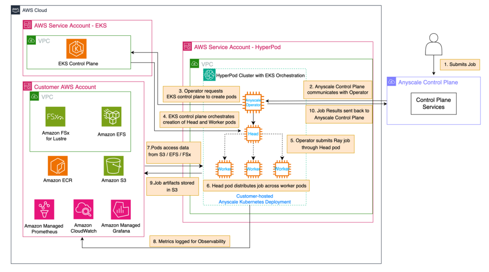

[![Build Status][badge-build]][build-status]
[![Terraform Version][badge-terraform]](https://github.com/hashicorp/terraform/releases)
[![AWS Provider Version][badge-tf-aws]](https://github.com/terraform-providers/terraform-provider-aws/releases)
[![Anyscale CLI][badge-anyscale-cli]](https://docs.anyscale.com/reference/quickstart-cli)

# Anyscale AWS SageMaker HyperPod EKS Example - New Cluster
This example creates the resources to setup a new SageMaker HyperPod cluster orchestrated on AWS EKS and creates the resources to run Anyscale on AWS EKS.

The content of this module should be used as a starting point and modified to your own security and infrastructure
requirements.

## Use Amazon SageMaker HyperPod and Anyscale for next-generation distributed computing
_by Sindhura Palakodety, Anoop Saha, Dominic Catalano, Florian Gauter, Alex Iankoulski, and Mark Vinciguerra on 09 OCT 2025 in [Advanced (300)](https://aws.amazon.com/blogs/machine-learning/category/learning-levels/advanced-300/), [Amazon Machine Learning](https://aws.amazon.com/blogs/machine-learning/category/artificial-intelligence/amazon-machine-learning/), [Amazon SageMaker Autopilot](https://aws.amazon.com/blogs/machine-learning/category/artificial-intelligence/sagemaker/amazon-sagemaker-autopilot/), [Amazon SageMaker HyperPod](https://aws.amazon.com/blogs/machine-learning/category/artificial-intelligence/sagemaker/amazon-sagemaker-hyperpod/), [Artificial Intelligence](https://aws.amazon.com/blogs/machine-learning/category/artificial-intelligence/), [Expert (400)](), [Generative AI](https://aws.amazon.com/blogs/machine-learning/category/artificial-intelligence/generative-ai/), [PyTorch on AWS](https://aws.amazon.com/blogs/machine-learning/category/artificial-intelligence/pytorch-on-aws/), [Technical How-to Permalink  Comments  Share](https://aws.amazon.com/blogs/machine-learning/category/post-types/technical-how-to/)_

_This post was written with Dominic Catalano from Anyscale._

Organizations building and deploying large-scale AI models often face critical infrastructure challenges that can directly impact their bottom line: unstable training clusters that fail mid-job, inefficient resource utilization driving up costs, and complex distributed computing frameworks requiring specialized expertise. These factors can lead to unused GPU hours, delayed projects, and frustrated data science teams. This post demonstrates how you can address these challenges by providing a resilient, efficient infrastructure for distributed AI workloads.

[Amazon SageMaker HyperPod](https://aws.amazon.com/sagemaker/ai/hyperpod/) is a purpose-built persistent generative AI infrastructure optimized for machine learning (ML) workloads. It provides robust infrastructure for large-scale ML workloads with high-performance hardware, so organizations can build heterogeneous clusters using tens to thousands of GPU accelerators. With nodes optimally co-located on a single spine, SageMaker HyperPod reduces networking overhead for distributed training. It maintains operational stability through continuous monitoring of node health, automatically swapping faulty nodes with healthy ones and resuming training from the most recently saved checkpoint, all of which can help save up to 40% of training time. For advanced ML users, SageMaker HyperPod allows SSH access to the nodes in the cluster, enabling deep infrastructure control, and allows access to SageMaker tooling, including Amazon SageMaker Studio, MLflow, and SageMaker distributed training libraries, along with support for various open-source training libraries and frameworks. SageMaker Flexible Training Plans complement this by enabling GPU capacity reservation up to 8 weeks in advance for durations up to 6 months.

The [Anyscale platform](https://www.anyscale.com/product/platform) integrates seamlessly with SageMaker HyperPod when using [Amazon Elastic Kubernetes Service](https://aws.amazon.com/eks/) (Amazon EKS) as the cluster orchestrator. [Ray](https://www.ray.io/) is the leading AI compute engine, offering Python-based distributed computing capabilities to address AI workloads ranging from multimodal AI, data processing, model training, and model serving. Anyscale unlocks the power of Ray with comprehensive tooling for developer agility, critical fault tolerance, and an optimized version called [Anyscale Runtime](https://www.anyscale.com/blog/announcing-anyscale-runtime-powered-by-ray), designed to deliver leading cost-efficiency. Through a unified control plane, organizations benefit from simplified management of complex distributed AI use cases with fine-grained control across hardware.

The combined solution provides extensive monitoring through [SageMaker HyperPod real-time dashboards](https://docs.aws.amazon.com/sagemaker/latest/dg/sagemaker-hyperpod-eks-cluster-observability.html) tracking node health, GPU utilization, and network traffic. Integration with Amazon CloudWatch Container Insights, [Amazon Managed Service for Prometheus](https://aws.amazon.com/prometheus/), and [Amazon Managed Grafana](https://aws.amazon.com/prometheus/) delivers deep visibility into cluster performance, complemented by [Anyscale’s monitoring framework](https://docs.anyscale.com/monitoring/metrics), which provides built-in metrics for monitoring Ray clusters and the workloads that run on them.

This post demonstrates how to integrate the Anyscale platform with SageMaker HyperPod. This combination can deliver tangible business outcomes: reduced time-to-market for AI initiatives, lower total cost of ownership through optimized resource utilization, and increased data science productivity by minimizing infrastructure management overhead. It is ideal for Amazon EKS and Kubernetes-focused organizations, teams with large-scale distributed training needs, and those invested in the [Ray ecosystem](https://www.anyscale.com/blog/understanding-the-ray-ecosystem-and-community) or SageMaker.

## Solution overview
The following architecture diagram illustrates SageMaker HyperPod with Amazon EKS orchestration and Anyscale.

The sequence of events in this architecture is as follows:

1. A user submits a job to the Anyscale Control Plane, which is the main user-facing endpoint.
2. The Anyscale Control Plane communicates this job to the Anyscale Operator within the SageMaker HyperPod cluster in the SageMaker HyperPod virtual private cloud (VPC).
3. The Anyscale Operator, upon receiving the job, initiates the process of creating the necessary pods by reaching out to the EKS control plane.
4. The EKS control plane orchestrates creation of a Ray head pod and worker pods. These pods represent a Ray cluster, running on SageMaker HyperPod with Amazon EKS.
5. The Anyscale Operator submits the job through the head pod, which serves as the primary coordinator for the distributed workload.
6. The head pod distributes the workload across multiple worker pods, as shown in the hierarchical structure in the SageMaker HyperPod EKS cluster.
7. Worker pods execute their assigned tasks, potentially accessing required data from the storage services – such as [Amazon Simple Storage Service](https://aws.amazon.com/s3/) (Amazon S3), [Amazon Elastic File System](https://aws.amazon.com/efs/) (Amazon EFS), or [Amazon FSx for Lustre](https://aws.amazon.com/fsx/lustre/) – in the user VPC.
8. Throughout the job execution, metrics and logs are published to [Amazon CloudWatch](https://aws.amazon.com/cloudwatch/) and Amazon Managed Service for Prometheus or Amazon Managed Grafana for observability.
9. When the Ray job is complete, the job artifacts (final model weights, inference results, and so on) are saved to the designated storage service.
10. Job results (status, metrics, logs) are sent through the Anyscale Operator back to the Anyscale Control Plane.

This flow shows distribution and execution of user-submitted jobs across the available computing resources, while maintaining monitoring and data accessibility throughout the process.

See [here](README.md) for instructions on setting this up.