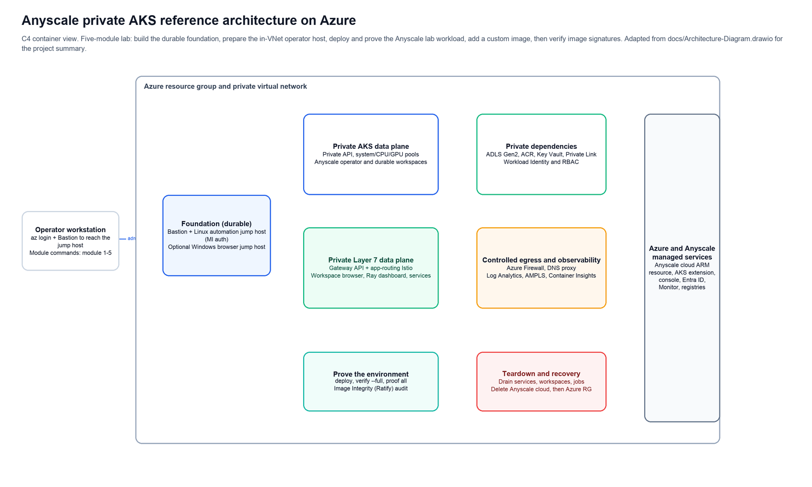
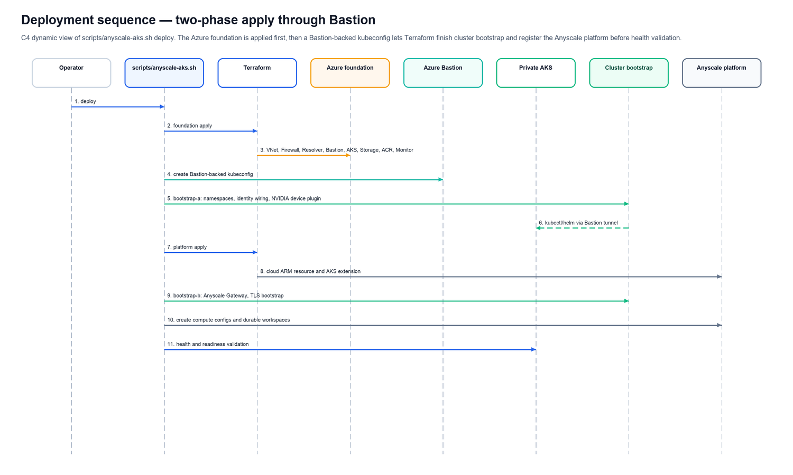
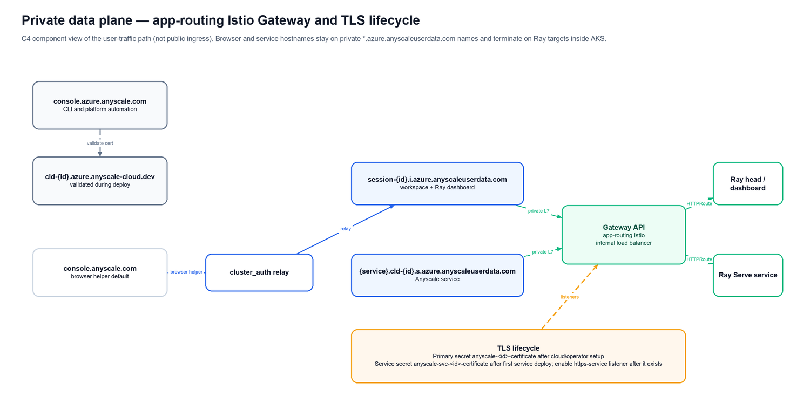
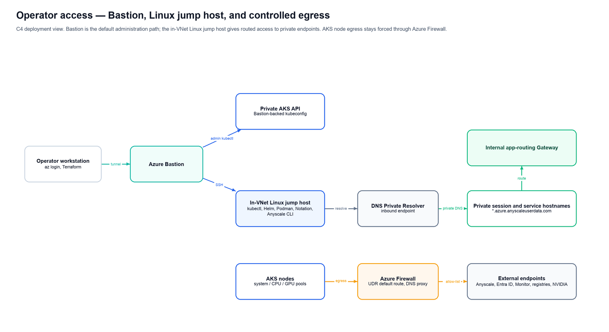
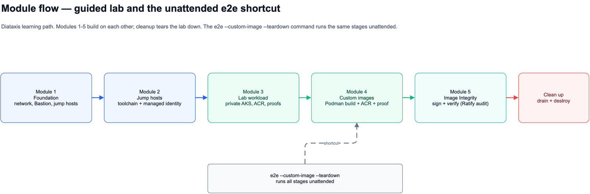

# Project Summary - Anyscale Private AKS Reference Architecture on Azure

> **Audience:** maintainers and contributors.
> **Scope:** this repository and its repo-local deployment, validation, proof, and teardown workflows.

This document summarizes the repository structure, architecture, operating
contracts, and contribution rules for maintainers. It is factual by design: use
it to understand where code lives, how the harness is wired, which invariants
must not change, and which files to update when extending the sample.

For operator instructions, use [`../../README.md`](../../README.md). For the guided
lab, use [`../modules/intro.md`](../modules/intro.md).

## Repository Purpose

This repository is an Azure private AKS reference architecture for Anyscale on
Azure. It contains:

- A single Terraform root under `infra/terraform`.
- A bash harness under `scripts/` for deploy, verify, proof, module, status,
  browser helper, custom-image, image-integrity, and teardown workflows.
- Workload proofs under `workloads/proofs/`.
- Custom-image and image-integrity assets under `workloads/custom-image/` and
  `workloads/image-integrity/`.
- Maintainer and lab documentation under `docs/`.

The sample provisions and validates:

- A private AKS cluster.
- Private storage and private Azure Container Registry (ACR).
- Azure Firewall egress with allow-lists.
- Azure Bastion and in-VNet jump hosts.
- Azure-native Anyscale platform resources.
- App-routing Istio Gateway API resources for private workspace and service
  traffic.
- Deterministic workload proofs for CPU, GPU, Anyscale jobs/services, custom
  images, and image-integrity audit behavior.

## Architecture Overview



The diagram shows the main deployed areas:

| Area | Maintainer notes |
| --- | --- |
| Durable foundation | VNet, subnets, Bastion, jump hosts, Firewall, DNS, observability, private endpoints, and local Terraform state. |
| Private AKS data plane | System, CPU, and GPU node pools plus Anyscale operator and durable workspaces. |
| Private Layer 7 data plane | AKS-managed Gateway API with app-routing Istio and an internal load balancer. |
| Private dependencies | ADLS Gen2, ACR, Key Vault, Private Link, Workload Identity, and RBAC. |
| Managed services | Anyscale cloud ARM resource, AKS extension, Anyscale console, Microsoft Entra ID, Azure Monitor, and container registries. |
| Validation and teardown | Re-runnable proof flow and drain-before-delete teardown contract. |

## Deployment Pipeline



`scripts/anyscale-aks.sh deploy` runs the full deployment. The deploy path is
split into two Terraform applies:

1. The foundation apply creates Azure infrastructure needed to reach the private
   cluster.
2. The platform apply runs after the harness can create a Bastion-backed
   kubeconfig and perform cluster bootstrap.

The current deploy stages are:

| # | Stage | Purpose |
| --- | --- | --- |
| 1 | `prepare` | Load `.env`, render `infra/terraform/terraform.auto.tfvars.json`, validate inputs, validate local tools, and confirm Azure sign-in. |
| 2 | `reset-or-state` | Reconcile existing Terraform state or reset with `--from-scratch`. |
| 3 | `terraform-init-validate` | Run Terraform init, format check, and validate. |
| 4 | `foundation` | Create VNet, Firewall, DNS Resolver, Bastion, private AKS, storage, ACR, Key Vault, and observability resources. |
| 5 | `bootstrap-a` | Configure namespaces, Workload Identity wiring, and NVIDIA device plugin from the private management path. |
| 6 | `platform` | Create the Anyscale cloud ARM resource, AKS extension, platform role assignments, and gateway configuration. |
| 7 | `bootstrap-b` | Install/reconcile the Anyscale Gateway chart and TLS bootstrap resources. |
| 8 | `workspaces` | Reconcile `aks-cpu` and `aks-gpu` compute configs and durable workspaces. |
| 9 | `health` | Validate cluster, extension, cloud resource, operator, Gateway, and workspace state. |

Run artifacts are local-only and are written under:

```text
.cache/aks-anyscale-sample-harness/runs/<timestamp>-<command>/
```

Each run directory contains `summary.md`, `stages.tsv`, and per-stage logs.

## Runtime and Access Flows

### Private data plane



User-facing Anyscale workspace and service traffic uses private hostnames and
routes through the internal Gateway. The important runtime pieces are:

| Runtime piece | Contract |
| --- | --- |
| Anyscale cloud endpoint | Uses the Azure Anyscale host and cloud endpoint naming documented in the README. |
| Workspace/session hostname | Uses `session-{id}.i.azure.anyscaleuserdata.com`; the hostname is private and resolves inside the VNet. |
| Service hostname | Uses `{service}.cld-{id}.s.azure.anyscaleuserdata.com`; the hostname routes through the internal Gateway. |
| Gateway | Uses Gateway API with `gatewayClassName: approuting-istio` and internal load-balancer annotations. |
| TLS secrets | Primary cloud TLS secret exists after cloud/operator setup; service TLS secret appears after the first service is deployed. |

### Operator access



Commands run from two places, and there is no mode flag to select between them —
the harness probes actual DNS on every run:

| Where | Auth | Notes |
| --- | --- | --- |
| Operator workstation/client | Azure CLI user auth | The default. Terraform runs here, with a Bastion-backed kubeconfig for private AKS access. |
| In-VNet Linux jump host | VM managed identity | Private network reachability. Runs post-configuration, proof, custom-image, and operational commands. Terraform must not run here. |

Reachability is decided per endpoint by `private_aks_api_dns_ready` and
`submitter_storage_private_dns_ready` (both built on `host_resolves_privately`),
so the same commands work from either machine.

Do not move Terraform execution to the jump host. The jump host is for private
post-configuration and validation surfaces such as `kubectl`, Helm, Podman,
Notation, and the Anyscale CLI.

## Core Components

| Component | Path | Purpose |
| --- | --- | --- |
| Terraform root | `infra/terraform/` | Owns the Azure and Anyscale deployment graph. |
| Anyscale platform wiring | `infra/terraform/anyscale.tf` | Defines the Anyscale cloud ARM resource, AKS extension, platform role assignments, and gateway config. |
| Network | `infra/terraform/modules/network` | VNet, subnets, and segmentation. |
| DNS | `infra/terraform/modules/dns`, `infra/terraform/modules/dns_resolver` | Private DNS zones and DNS Private Resolver. |
| Firewall and routing | `infra/terraform/modules/firewall`, `infra/terraform/modules/routing` | Forced egress and UDR routing. |
| Bastion | `infra/terraform/modules/bastion` | Private administration entry point. |
| Jump hosts | `infra/terraform/modules/jump_host`, `infra/terraform/modules/browser_jump_host` | Linux automation and optional Windows browser access. |
| AKS | `infra/terraform/modules/aks` | Private AKS cluster, node pools, OIDC, Workload Identity, Gateway API, and ACR pull wiring. |
| ACR | `infra/terraform/modules/acr` | Private Premium container registry. |
| Storage | `infra/terraform/modules/storage` | ADLS Gen2 storage with Azure AD auth and private endpoints. |
| Identity | `infra/terraform/modules/identity` | User-assigned managed identity and federated credential for the Anyscale operator. |
| Key Vault | `infra/terraform/modules/keyvault` | Private Key Vault used by image signing. |
| Image Integrity | `infra/terraform/modules/image_integrity` | Ratify identity and RBAC support. |
| Observability | `infra/terraform/modules/observability` | Log Analytics, AMPLS, and Container Insights. |
| Cluster bootstrap | `infra/terraform/modules/cluster_bootstrap` | Kubernetes namespaces, Gateway chart, device plugin, and identity wiring. |
| Dispatcher | `scripts/anyscale-aks.sh` | Main user-facing CLI. |
| Core harness | `scripts/setup.sh` | Shared implementation for deploy, validation, proof, custom image, image integrity, and teardown. |
| Module wrappers | `scripts/modules/` | Lab module entry points. |
| Shared shell libraries | `scripts/lib/` | Timeout, logging, tunnel, teardown, and helper libraries. |
| Proof scripts | `workloads/proofs/` | Deterministic workload proof payloads and markers. |
| Custom image | `workloads/custom-image/` | Dockerfile and requirements for the custom Ray image. |
| Image integrity manifests | `workloads/image-integrity/` | Ratify trust policy resources and verifier manifests. |

## CLI and Proof Contracts

### Main CLI

The main dispatcher is `scripts/anyscale-aks.sh`.

| Command | Maintainer contract |
| --- | --- |
| `init` | Writes `.env` from `.env-template`, filling the Azure ids from `az account show`, deriving `region_short`, and generating the jump-host SSH key if absent. Local and reversible; refuses to overwrite an existing `.env` without `--force`, which backs it up first. |
| `doctor` | Checks local or jump-host readiness. It reports missing dependencies; it does not install the harness toolchain. |
| `deploy` | Runs the staged deployment. Mutates Azure and Anyscale resources. Requires explicit user instruction before running. |
| `verify --static` | Runs static Terraform-oriented checks. |
| `verify --live` | Checks live infrastructure state. Requires deployed resources. |
| `verify --full` | Runs static and live checks. |
| `proof cpu`, `proof gpu`, `proof pipeline`, `proof all` | Runs deterministic workload proofs. |
| `module <n> <stage>` | Runs guided module stages. |
| `custom-image preflight`, `prepare`, `apply`, `proof` | Builds, pushes, applies, and proves the custom Ray image flow. |
| `image-integrity ...` | Signs/verifies images and validates Ratify/Azure Policy audit behavior. |
| `e2e` | Runs a full lifecycle path from this machine. Optional flags include custom image and teardown. |
| `teardown` | Drains Anyscale resources before Terraform destroy. |
| `teardown --confirm-project <name>` | Non-interactive standard teardown confirmation. The value must match `TF_VAR_project`. |
| `teardown --force --yes` | Force resource-group reset path. Treat as destructive. |

### Proof markers

Proof scripts print deterministic output and a success marker. Harness checks
should assert on the marker, not on incidental log text.

| Proof | Source | Marker |
| --- | --- | --- |
| CPU Ray | `workloads/proofs/cpu_ray_proof.py` | `CPU_RAY_PROOF_OK` |
| GPU Ray | `workloads/proofs/gpu_ray_proof.py` | `GPU_RAY_PROOF_OK` |
| CPU build job | `workloads/proofs/anyscale_build_cpu_job_proof.py` | `CPU_BUILD_JOB_PROOF_OK` |
| GPU train job | `workloads/proofs/anyscale_train_gpu_job_proof.py` | `GPU_TRAIN_JOB_PROOF_OK` |
| GPU serve service | `workloads/proofs/anyscale_serve_gpu_proof.py` | `GPU_SERVE_SERVICE_PROOF_OK` |
| Custom-image dependency | `workloads/proofs/custom_image_dependency_proof.py` | `CUSTOM_IMAGE_DEPENDENCY_PROOF_OK` |

Custom-image and image-integrity flows also use:

- `CUSTOM_IMAGE_STANDARD_IMAGE_EXPECTED_FAILURE_OK`
- `CUSTOM_IMAGE_PREFLIGHT_OK`
- `CUSTOM_IMAGE_BUILD_OK`
- `CUSTOM_IMAGE_SIGN_OK`
- `CUSTOM_IMAGE_VERIFY_OK`
- `IMAGE_INTEGRITY_PREFLIGHT_OK`
- `IMAGE_INTEGRITY_RATIFY_OK`

Do not document environment-specific cloud IDs, subscription IDs, tenant IDs,
object IDs, ACR names, storage names, tokens, or image digests in committed
files. Use placeholders such as `{id}`, `{service}`, and `sha256:<digest>`.

## Module Flow



The guided path is:

1. Module 1: foundation.
2. Module 2: jump hosts.
3. Module 3: lab workload.
4. Module 4: custom image.
5. Module 5: image integrity.
6. Cleanup.

The `e2e --custom-image --teardown` path runs the same broad
sequence unattended when the environment and credentials are ready.

## Maintainer Workflows

### Shell changes

- Follow `.github/instructions/shell.instructions.md`.
- Run `bash -n` on every changed shell script.
- Use existing logging, stage, and timeout helpers.
- Preserve the run artifact shape: `summary.md`, `stages.tsv`, and
  `logs/XX-*.log`.

### Terraform changes

- Follow `.github/instructions/terraform.instructions.md`.
- Run `terraform -chdir=infra/terraform fmt -check -recursive`.
- Run validation only when Terraform is initialized and the operation is safe.
- Do not commit real values in `.tfvars.json`.

### Proof changes

- Follow `.github/instructions/proofs.instructions.md`.
- Run `python3 -m py_compile` on changed proof scripts.
- Keep proof output deterministic.
- Emit a JSON payload followed by a bare success marker.

### Documentation changes

- Keep user-facing wording plain.
- Do not include internal work-package IDs.
- Do not include secrets or environment-specific IDs.
- Update related module docs when behavior changes.
- Keep generated or local run evidence out of commits unless it is explicitly
  intended documentation, such as `docs/expected-proof-markers.md`.

## Extension Points

| Area | How to extend safely |
| --- | --- |
| New lab capability | Add it to the module flow or `e2e` flow instead of creating a parallel entry point. |
| New proof | Add a proof script under `workloads/proofs/`, emit a stable marker, and wire the harness to assert on it. |
| Custom image dependency | Add it to `workloads/custom-image/`, build on the Linux jump host with Podman, push to private ACR, then apply the image URI to workspaces/jobs/services. |
| Firewall allow-list | Extend the appropriate `TF_VAR_*_fqdns` inputs. Do not bypass Firewall or disable private networking. |
| Platform RBAC | Use `TF_VAR_anyscale_platform_role_assignments`. |
| GPU sizing | Adjust `TF_VAR_gpu_pool_configs` and account for workspace/service capacity. An empty map is a supported CPU-only shape: no GPU pool, no device plugin, no `aks-gpu` compute config or workspace, and the GPU/train/serve proofs skip with a logged reason. |
| Image integrity | Update `workloads/image-integrity/` and the `image_integrity` module together. Remember this sample treats Image Integrity as audit/reporting, not blocking enforcement. |

## Rules and Anti-Patterns

These rules are enforced by repo instructions and the quality gates for each path.

### Do

- Keep AKS private.
- Keep storage and ACR private-only.
- Keep ACR pulls Azure-native through kubelet identity `AcrPull`.
- Keep Terraform on the workstation/client.
- Use the Linux jump host for private post-configuration, custom-image build and
  push, and in-VNet proof execution.
- Prefer cached Azure CLI auth and cached Anyscale OAuth.
- Use `anyscale login` for local Anyscale auth recovery.
- Drain Anyscale services, jobs, workspaces, and sessions before deleting the
  cloud or resource group.

### Do not

- Do not fabricate or require `ANYSCALE_CLI_TOKEN` without proving the specific
  command cannot use cached OAuth.
- Do not print or commit tokens, keys, subscription IDs, tenant IDs, object IDs,
  bearer values, or SSH private keys.
- Do not make `az acr build` the default private-ACR build path.
- Do not run Terraform from the jump host.
- Do not introduce registry login secrets for AKS pulls.
- Do not weaken teardown or nuke safety prompts.
- Do not run mutating deploy, apply, e2e, teardown, nuke, Azure, or Anyscale
  commands without explicit user instruction.
- Do not use machine-specific paths in committed files.
- Do not use localhost hostname rewriting for browser access; it breaks TLS
  validation.

## Dependencies

The harness checks dependencies; it does not install the full workstation
toolchain.

| Dependency | Used for |
| --- | --- |
| Azure CLI | Azure auth, resource checks, AKS/Bastion operations. |
| Terraform `>= 1.9.0` | Azure and Anyscale infrastructure deployment. |
| `kubectl` and `kubelogin` | AKS validation and cluster bootstrap. |
| Helm | Gateway and cluster add-on installation. |
| `jq` | JSON rendering and parsing in the harness. |
| Python `3.9+` and `uv` | Proof scripts and Anyscale CLI environment. |
| Anyscale CLI | Cloud, workspace, job, service, compute config, and image operations. |
| Podman | Custom image build on the Linux jump host. |
| Notation and `notation-azure-kv` | Custom image signing with Key Vault. |
| `curl`, `rsync`, `lsof` | Harness support operations. |

Terraform providers are declared in
[`infra/terraform/versions.tf`](../../infra/terraform/versions.tf), including:

- `hashicorp/azurerm`
- `azure/azapi`

## Code Structure

| Path | Purpose |
| --- | --- |
| `infra/terraform/` | Terraform root, modules, provider config, outputs, and tests. |
| `infra/terraform/modules/` | Reusable Azure and Kubernetes module implementations. |
| `scripts/anyscale-aks.sh` | Main dispatcher. |
| `scripts/setup.sh` | Core harness implementation. |
| `scripts/modules/` | Module-specific wrappers. |
| `scripts/lib/` | Shared shell helper libraries. |
| `scripts/bootstrap-jump-host.sh` | Linux jump-host provisioning script. |
| `workloads/proofs/` | Deterministic proof scripts. |
| `workloads/custom-image/` | Custom Ray image Dockerfile and requirements. |
| `workloads/image-integrity/` | Ratify verifier and trust policy manifests. |
| `docs/modules/` | Guided module documentation. |
| `docs/diagrams/` | Editable project summary diagrams and PNG exports. |
| `docs/expected-proof-markers.md` | Current proof-marker checklist and guidance for reading generated results. |
| `docs/dev/` | Developer and maintainer documentation, including this summary. |
| `.github/instructions/` | Path-scoped coding instructions. |
| `.env-template` | Template for local `.env`; real `.env` is git-ignored. |

## Related Documentation

- [`../../README.md`](../../README.md) - operator guide.
- [`../modules/intro.md`](../modules/intro.md) - lab module entry point.
- [`../modules/module-1-foundation.md`](../modules/module-1-foundation.md) - foundation module.
- [`../modules/module-2-jump-hosts.md`](../modules/module-2-jump-hosts.md) - jump-host module.
- [`../modules/module-3-lab-workload.md`](../modules/module-3-lab-workload.md) - lab workload module.
- [`../modules/module-4-custom-image.md`](../modules/module-4-custom-image.md) - custom image module.
- [`../modules/module-5-image-integrity.md`](../modules/module-5-image-integrity.md) - image integrity module.
- [`../modules/cleanup.md`](../modules/cleanup.md) - cleanup and teardown.
- [`Implementation-Notes.md`](Implementation-Notes.md) - implementation notes and current caveats.
- [`Developer-Workflows.md`](Developer-Workflows.md) - maintainer workflows.
- [`../expected-proof-markers.md`](../expected-proof-markers.md) - proof-marker checklist. The repo-root `RESULTS.md` is generated per `e2e` run and is gitignored.
