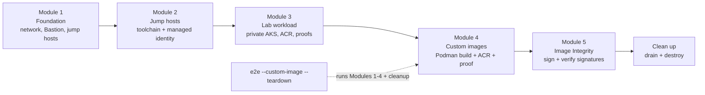

# Anyscale on Private AKS — Hands-On Lab

> **Difficulty:** Advanced | **Roles:** Platform Engineer, DevOps Engineer | **Time:** ~10 min to read; 2–3 hrs to complete

Welcome. This lab teaches you how to operate Anyscale on a **private** Azure
Kubernetes Service (AKS) cluster the way a platform team would in production:
from a trusted automation host inside the virtual network, not from a developer
laptop with broad network reach.

You will work through five modules. Each one builds on the previous one, and
each maps to a `module` subcommand of `./scripts/anyscale-aks.sh`.

| Module | You build | Primary command |
| --- | --- | --- |
| [Module 1: Foundation](module-1-foundation.md) | The network boundary, Bastion, Linux automation jump host, and optional Windows browser jump host. | `module 1` |
| [Module 2: Jump hosts](module-2-jump-hosts.md) | A repeatable in-VNet operator workstation on the Linux jump host (and optional Windows browser host readiness). | `module 2` |
| [Module 3: Lab workload](module-3-lab-workload.md) | Private AKS, private ACR, the Anyscale cloud, and the workload proofs. | `module 3` |
| [Module 4: Custom images](module-4-custom-image.md) | The custom-image requirement: prove standard-image failure, build and push a custom Ray image to the private ACR, and prove the dependency loads. | `module 4` |
| [Module 5: Image Integrity](module-5-image-integrity.md) | Sign the custom image and verify it with AKS Image Integrity (Ratify + Azure Policy): signed images are compliant, unsigned images are flagged. | `module 5` |

By the end of this lab, you're able to:

- Build a private AKS network boundary: VNet, Bastion, firewall, DNS resolver, and jump hosts.
- Bootstrap an in-VNet Linux automation host that authenticates with a managed identity — no stored secrets.
- Deploy private AKS with Anyscale on Azure and validate it with deterministic CPU, GPU, build, train, and serve proofs.
- Demonstrate the custom-image requirement and prove a private-data-plane dependency loads from a private ACR.
- Sign that image with Notation and Key Vault, and use AKS Image Integrity to show signed images as compliant and unsigned images as flagged in Azure Policy audit mode.

The five modules build on each other, and the unattended `e2e` command runs the same
stages end to end:



One cross-cutting lesson is available throughout the lab:

- [Browser access](browser-access.md) — how to reach private Anyscale workspace
  and service URLs from a browser, and why that is separate from API access.

After Module 5, finish with [Clean up](cleanup.md) to drain Anyscale resources
and tear down the lab.

## Why a jump host

The workload AKS cluster is private. Its API server, storage, and container
registry have no public endpoints. Rather than punch routed connectivity from
every operator laptop into the VNet, you stand up a **Linux automation jump
host** inside the VNet and run the operations that require private endpoints —
Podman pushes to the private ACR, and Anyscale CLI job/service submits — from
there. Terraform stays on your workstation and is not run from the jump host in
the default workflow; see [running Terraform from the jump
host](#running-terraform-from-the-jump-host) for that option and what it costs.
The jump host authenticates to Azure with a **managed identity**, so there are no
long-lived secrets on the box.

The optional **Windows 11 browser jump host** solves a different problem:
console-launched Anyscale URLs redirect to private `*.azure.anyscaleuserdata.com`
hostnames. A browser running *inside* the VNet resolves and reaches them
natively. See [browser-access.md](browser-access.md).

## Two ways to run every module

Every module can be run two ways, and both execute the same underlying stages:

- **Step by step** — run each `module N <stage>` command yourself and read the
  output. This is the recommended path while learning.
- **Unattended** — run the full lifecycle in one command:

  ```bash
  ./scripts/anyscale-aks.sh e2e --custom-image --teardown
  ```

## Which machine runs what

Two questions get conflated constantly, so keep them apart:

**1. Which steps need to run inside the VNet?** Some genuinely do, and no flag
changes that:

| Step | Why it needs to be in-VNet |
| --- | --- |
| Podman build + push (`--custom-image`) | The ACR has no public endpoint; its login and data endpoints only resolve through private DNS. |
| Anyscale job and service submits (`proof all` build/train/serve stages) | The CLI uploads your working directory to a private storage account. From outside, the upload fails with HTTP 403. |

Everything else — `terraform apply`, `verify --full`, the workspace CPU/GPU
proofs — works fine from your workstation over Bastion.

**2. Which machine runs Terraform?** This is a separate choice, and the answer
for almost everyone is *your workstation*. The jump host is a network-adjacent
runner for the steps in the table above, not a Terraform host.

The harness does not ask you which is which. It probes actual DNS on every run:
if the private AKS API FQDN resolves to a private address from this machine it
talks to the API directly, otherwise it opens a Bastion tunnel. The job/service
proofs gate the same way, on whether the private Storage endpoints resolve here.
So the same commands work from either place, and a workstation on a VPN peered
into the VNet is treated as adjacent because it *is*.

## Running Terraform from the jump host

If your organization forbids workstation-originated applies, you can run every
stage on the jump host, Terraform included. There is no flag for this: sync the
repo with `module 2 sync`, connect, and run the same commands there. The DNS
probes described above do the rest.

That scenario has a real permission cost, though. Terraform creates role
assignments, so the VM's managed identity needs
`TF_VAR_assign_jump_host_rbac_admin=true` — "Role Based Access Control
Administrator" at subscription scope, on top of Contributor. That combination
lets anyone who reaches the VM assign roles at that scope, **including roles you
cannot assign yourself**. It also fails to apply outright if your own RBAC
Administrator carries the standard "don't allow assigning privileged
administrator roles" ABAC condition. The default is `false`; leave it there
unless you have deliberately chosen this setup.

## Prerequisites

- An Azure subscription where you can create networking, AKS, ACR, VMs, and role
  assignments.
- Azure CLI signed in on the machine you start from (`az login`), then
  `./scripts/anyscale-aks.sh init` to generate `.env` from your Azure context.
- An Anyscale on Azure account reachable at `https://console.azure.anyscale.com`.
- The tools listed by `./scripts/anyscale-aks.sh doctor`. Module 2 installs
  these automatically on the jump host.

## Next unit

Start with [Module 1: Build the Foundation](module-1-foundation.md).
