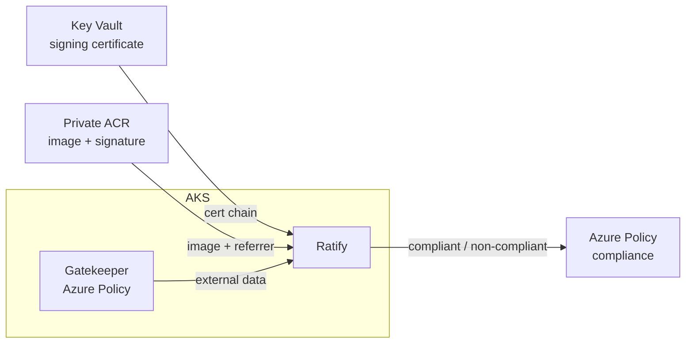

# Module 5: AKS Image Integrity (Signature Verification)

> **Difficulty:** Advanced | **Roles:** Platform Engineer, Security Engineer | **Time:** 30–45 min

By the end of this module, you're able to:

- Explain how AKS Image Integrity verifies container image signatures with Ratify
  and Azure Policy in audit mode.
- Apply the Ratify verification configuration that trusts your Key Vault signing
  certificate.
- Show the difference between a **signed** image (compliant) and an **unsigned**
  image (non-compliant) on the same cluster.

This module builds directly on [Module 4](module-4-custom-image.md), where you
built, pushed, and **signed** a custom image in the private ACR.

## Important: Image Integrity is audit-only

AKS Image Integrity is a **Preview** feature and, by design, runs in **audit**
mode only. It **does not block** unsigned images from running. Instead, it reports
each image as **compliant** or **non-compliant** in Azure Policy and logs the
verification result in the Ratify pod. This module demonstrates that compliant vs
non-compliant signal — not an admission-time rejection. Microsoft also notes the
preview is not for production registries or workloads.

## What You Will Build

- The Azure Policy "Image Integrity" initiative assignment, remediation, and the
  Ratify pod it deploys (provisioned by Terraform).
- Ratify CRDs that trust the Notation signing certificate stored in your Key
  Vault and check signatures on images in your private ACR repository.
- A side-by-side demo: a signed image that verifies as **compliant** and an
  unsigned image that is flagged **non-compliant**.

## Why This Matters

Signing proves an image came from a trusted publisher and was not modified after
build. Image Integrity lets a platform team continuously check that workloads run
only signed images, and surface any that are not — a supply-chain control on top
of the private data plane you built in Modules 1–4. It complements the cluster
hardening already in place by giving you a second control point: even with the
namespace and pod-security defaults in place, the image signature check tells you
whether the container content itself is trusted and unchanged.

## How it works



Terraform manages the Azure-side infrastructure: the private Key Vault, Ratify
workload identity and its Key Vault/ACR access, the AKS Azure Policy add-on, the
Image Integrity policy assignment, and policy remediation. The signing command
bootstraps the Notation certificate inside the private Key Vault from the jump
host, because the workstation cannot reach the private-only Key Vault data plane.
Module 5 applies the Ratify CRDs from the jump host for the same reason.

## Prerequisites

- [Module 4](module-4-custom-image.md) completed, including `module 4 sign` and
  `module 4 verify` (`CUSTOM_IMAGE_SIGN_OK` / `CUSTOM_IMAGE_VERIFY_OK`).
- `terraform apply` has been run after adding the signing + Image Integrity
  resources, so the cluster has the Azure Policy add-on, policy assignment, and
  remediation.
- The `EnableImageIntegrityPreview` subscription feature is registered. The
  preflight checks this provider opt-in before you apply the Ratify CRDs.
- The `aks-preview` Azure CLI extension is installed (`>= 0.5.96`).

## Exercise 1: Preflight

```bash
./scripts/anyscale-aks.sh module 5 preflight
```

This checks the feature flag state and the `aks-preview` extension version and
prints `IMAGE_INTEGRITY_PREFLIGHT_OK`. If the feature is not yet `Registered`,
the output shows the `az feature register` commands and you wait for it to settle.

## Exercise 2: Apply the Ratify verification configuration

Run this from the jump host. The command downloads the public signing
certificate from the private Key Vault, renders it into the Ratify
`CertificateStore`, and applies the CRDs with the direct private AKS kubeconfig.

```bash
./scripts/anyscale-aks.sh module 5 apply-ratify
```

This waits for the Ratify pod (deployed by the policy in `gatekeeper-system`),
then applies three CRDs from `workloads/image-integrity/`:

- `certstore.yaml` — a `CertificateStore` that trusts the public signing
  certificate bootstrapped from Key Vault.
- `store.yaml` — a `Store` that reads images and signatures from the private ACR.
- `verifier.yaml` — a `Verifier` with a Notation trust policy scoped to your ACR
  repository and signing-certificate subject.

It prints `IMAGE_INTEGRITY_RATIFY_OK`.

## Exercise 3: Deploy the signed image (compliant)

Deploy the image you signed in Module 4 into a dedicated demo namespace:

```bash
kubectl create namespace image-integrity-demo
kubectl run demo-signed \
  --namespace image-integrity-demo \
  --image cr<project><env><region>.azurecr.io/anyscale/proof-custom:onnxruntime-1.22.0-ray-2.55.1-py312-cu129 \
  --command -- sleep 3600
```

The pod starts. Ratify verifies the signature against the Key Vault certificate,
and Azure Policy records the image as **compliant**.

In Ratify logs, the successful path looks like this:

```output
"isSuccess": true
"message": "Notation signature verification success"
```

## Exercise 4: Build and deploy an unsigned image (non-compliant)

Create a second image in the same repository that is **not** signed. Re-tagging the
base Ray image gives a distinct digest with no signature. Run this on the jump
host (it reaches the private ACR):

```bash
ACR=cr<project><env><region>
podman pull docker.io/anyscale/ray:2.55.1-slim-py312-cu129
podman tag docker.io/anyscale/ray:2.55.1-slim-py312-cu129 "${ACR}.azurecr.io/anyscale/proof-custom:unsigned"
TOKEN="$(az acr login --name "${ACR}" --expose-token --query accessToken -o tsv)"
printf '%s' "${TOKEN}" | podman login "${ACR}.azurecr.io" --username 00000000-0000-0000-0000-000000000000 --password-stdin
podman push "${ACR}.azurecr.io/anyscale/proof-custom:unsigned"
```

Then deploy it:

```bash
kubectl run demo-unsigned \
  --namespace image-integrity-demo \
  --image cr<project><env><region>.azurecr.io/anyscale/proof-custom:unsigned \
  --command -- sleep 3600
```

The pod still starts (audit mode does not block it), but Ratify cannot find a valid
signature, so Azure Policy records the image as **non-compliant**. This is the
"error" the walkthrough surfaces.

The failure path looks like this:

```output
"isSuccess": false
"errorReason": "No verification results for the artifact ..."
```

## Observe the result

Check the Ratify verification logs:

```bash
kubectl logs -n gatekeeper-system -l app=ratify --tail=100
```

You see a successful verification for `:onnxruntime-...` and a failed verification
for `:unsigned`.

Check Azure Policy compliance for the cluster (compliance evaluation can lag a few
minutes):

```bash
az policy state list \
  --resource-group rg-<project>-<env>-<region> \
  --filter "complianceState eq 'NonCompliant'" \
  --query "[].{resource:resourceId, policy:policyDefinitionName}" -o table
```

The unsigned pod appears as non-compliant; the signed pod does not.

## Troubleshooting

- **Ratify pod never becomes Ready** — the policy remediation deploys it after an
  update operation on the cluster. Re-run `module 5 apply-ratify` once the
  `gatekeeper-system` Ratify pod is running, or trigger a policy remediation.
- **`apply-ratify` reports it cannot read Terraform outputs** — this is expected
  on the jump host, which has no Terraform state. Re-sync the current scripts and
  re-run; the harness derives the Key Vault URI, ACR login server, and Ratify
  client id from `.env`/Azure when Terraform state is unavailable.
- **Both images show compliant** — confirm the unsigned image has a different
  digest from the signed one. Re-tagging the base image (above) guarantees this.
- **Signature not found for the signed image** — re-run `module 4 verify` to
  confirm the signature is attached, and check the trust policy scope in
  `workloads/image-integrity/verifier.yaml` matches your ACR repository.
- **Ratify cannot read ACR** — confirm the Ratify workload identity has `AcrPull`
  on the private ACR. Without it, Ratify logs show ACR `401 unauthorized` errors.
- **Ratify cannot find the certificate** — confirm `certstore-inline` exists in
  the `gatekeeper-system` namespace and has `issuccess: true`.

## Limitations to keep in mind

- Audit-only: Image Integrity reports compliance but does not block deployments.
- Preview: not for production registries or workloads.
- Notation is the only supported verifier, and the feature supports a maximum of
  200 unique signatures cluster-wide.
- Requires Kubernetes 1.26 or later.

## Clean up resources

```bash
kubectl delete namespace image-integrity-demo
```

The Key Vault, certificate, Ratify identity, and policy assignment are removed with
`module 3 teardown`. See [Clean Up](cleanup.md).

## Next unit

- [Clean up](cleanup.md) — tear down the lab when you are finished.
